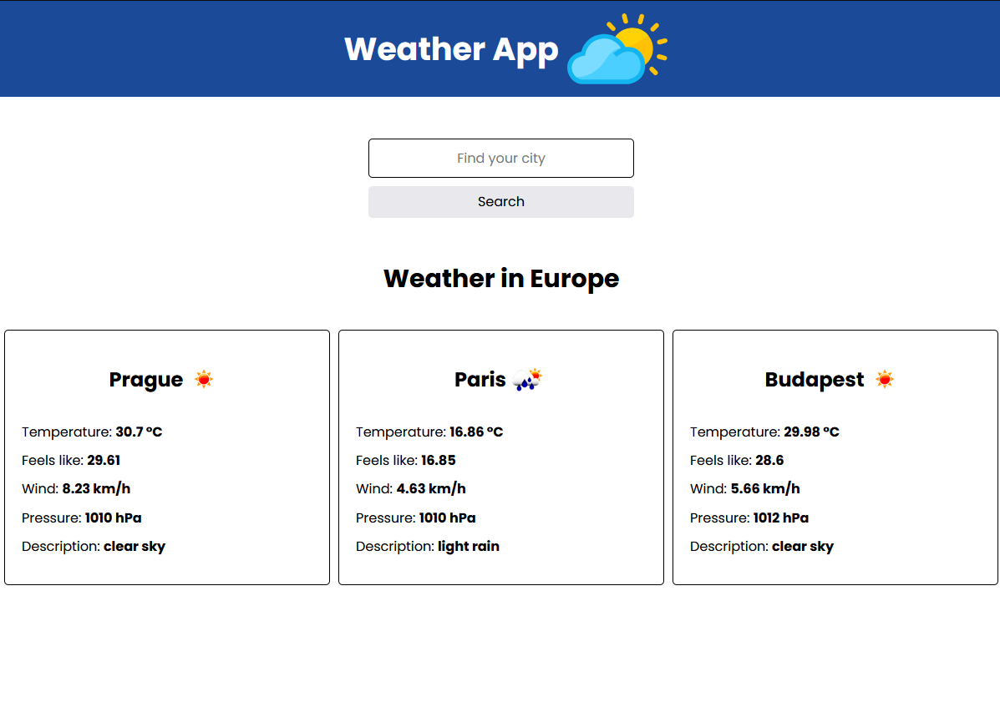

## Demo
https://michalwodniczak.github.io/weather

## Description

Project Description:

WeatherApp is a modern weather application that allows users to quickly and conveniently check current weather conditions. Upon launching the app, users immediately see the weather for three randomly selected cities in Europe. With an intuitive interface, users can also access detailed information about temperature, atmospheric pressure, and wind speed for their selected location.

App Features:

    Current Weather: Displays current weather conditions, including temperature, atmospheric pressure, and wind speed, for a selected location.
    Random Cities: Upon launching, the app shows the weather for three randomly chosen cities in Europe.
    Location Search: Allows users to add and manage multiple locations to track current weather in different places.
    User Interface: Features a friendly and intuitive design for easy app usage.

Technologies: The app is developed using React, Redux, Saga, and Styled Components, ensuring smooth performance and an aesthetic interface across various platforms. It utilizes data from the OpenWeatherMap API to provide accurate and up-to-date weather information.

Project Goal: The goal of the application is to acquire knowledge about fetching data from APIs and to provide users with easy access to accurate current weather information in a simple and convenient way.

### `npm start`

Runs the app in the development mode.\
Open [http://localhost:3000](http://localhost:3000) to view it in your browser.

The page will reload when you make changes.\
You may also see any lint errors in the console.

### `npm run build`

Builds the app for production to the `build` folder.\
It correctly bundles React in production mode and optimizes the build for the best performance.

The build is minified and the filenames include the hashes.\
Your app is ready to be deployed!

See the section about [deployment](https://facebook.github.io/create-react-app/docs/deployment) for more information.

### `npm run eject`

**Note: this is a one-way operation. Once you `eject`, you can't go back!**

If you aren't satisfied with the build tool and configuration choices, you can `eject` at any time. This command will remove the single build dependency from your project.

Instead, it will copy all the configuration files and the transitive dependencies (webpack, Babel, ESLint, etc) right into your project so you have full control over them. All of the commands except `eject` will still work, but they will point to the copied scripts so you can tweak them. At this point you're on your own.

You don't have to ever use `eject`. The curated feature set is suitable for small and middle deployments, and you shouldn't feel obligated to use this feature. However we understand that this tool wouldn't be useful if you couldn't customize it when you are ready for it.

### Deployment

This section has moved here: [https://facebook.github.io/create-react-app/docs/deployment](https://facebook.github.io/create-react-app/docs/deployment)

### `npm run build` fails to minify

This section has moved here: [https://facebook.github.io/create-react-app/docs/troubleshooting#npm-run-build-fails-to-minify](https://facebook.github.io/create-react-app/docs/troubleshooting#npm-run-build-fails-to-minify)
